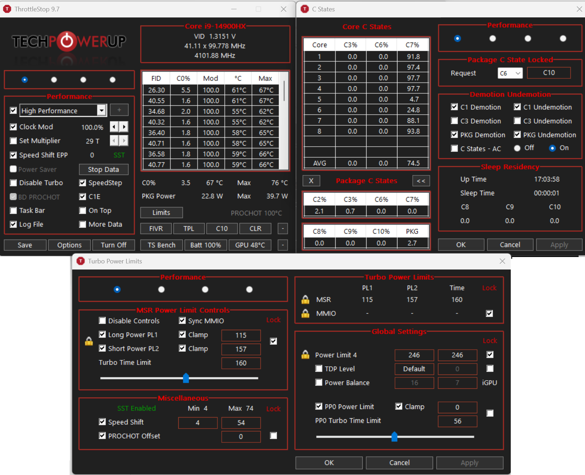

# Acer Predator PHN16-72 — BSOD Fix & Stability Toolkit


Fixes BSOD crashes on Acer Predator Helios Neo 16 (PHN16-72) with Intel 14th Gen CPUs.

## What's in this repo

| Component | What it does |
|-----------|-------------|
| `HeliosPHN16-72_Setup.ps1` | Removes bad drivers (GNA, DPTF APO), blocks Windows Update reinstalls, installs stable versions |
| `HeliosPHN16-72_Check.ps1` | Verifies all fixes are applied |
| [`PredatorGuard/`](PredatorGuard/) | Simple hardcoded tool: applies fixed known-good power settings and locks CPU power registers |
| [`THROTTLESTOP.md`](THROTTLESTOP.md) | Solid manual alternative: more customizable, but easier to misconfigure |

## Prerequisites

**Update your BIOS first.** The latest Acer BIOS fixes the `intelppm.sys` conflict. Intel PPM no longer needs to be disabled.

## Quick Start

### 1. Run the driver cleanup script

```powershell
Set-ExecutionPolicy -ExecutionPolicy Bypass -Scope Process
.\HeliosPHN16-72_Setup.ps1
```

This removes known-bad drivers (GNA, DPTF APO, Killer bloatware), blocks Windows Update from reinstalling them, and installs stable driver versions in the correct order.

### 2. Lock MSR registers (choose one)

**Option A: PredatorGuard** (simple, automated, open source)

```bash
PredatorGuard.exe --lock-only    # Lock current power limits
PredatorGuard.exe                # Apply Performance profile + lock
PredatorGuard.exe --profile game # Apply Game profile + lock
PredatorGuard.exe --status       # Show current MSR values
```

Use it with this repo's settings like this:

1. `PredatorGuard.exe`
   Applies the default **Performance** preset from this repo:
   `PL1=115W`, `PL2=157W`, `Speed Shift Min=4`, `Max=54`, `EPP=0`, turbo capped at `5.4 GHz`, then locks the power limits.
2. `PredatorGuard.exe --profile game`
   Uses the repo's **Game** preset if you want a lower sustained power limit (`PL1=55W`) while keeping the same 5.4 GHz cap.
3. `PredatorGuard.exe --lock-only`
   Use this only if your power limits are already set the way you want and you only need the lock.
4. `PredatorGuard.exe --status`
   Check the current MSR values after applying the preset.

Set up Task Scheduler to run at boot:
```powershell
schtasks /create /tn "PredatorGuard" /tr "`"C:\path\to\PredatorGuard.exe`" --lock-only" /sc onstart /rl highest /ru SYSTEM /f
```

Requires [WinRing0](https://github.com/GermanAizek/WinRing0) driver. See [PredatorGuard/README.md](PredatorGuard/README.md).

> **Note:** WinRing0 is on Microsoft's Vulnerable Driver Blocklist. May require disabling Memory Integrity.

PredatorGuard is intentionally the simpler path: fixed profiles, no live tuning, less room for accidental misconfiguration.

**Option B: ThrottleStop** (solid GUI alternative, but riskier)

See [`THROTTLESTOP.md`](THROTTLESTOP.md) for the exact settings. It is more customizable and more powerful, but also easier to get wrong. Key points:
- TPL: PL1=115W, PL2=157W, **Lock=ON**
- Speed Shift: Min=4, **Max=54** (caps turbo at 5.4 GHz)
- EPP=0 (max performance)



### 3. Verify

```powershell
.\HeliosPHN16-72_Check.ps1
```

## Correct drivers to install

Download these from Acer for the PHN16-72:

| Driver | Correct version / variant | Notes |
|--------|----------------------------|-------|
| Intel Chipset | Acer package | Install first. Includes Serial IO / I2C base support |
| Intel ME | Acer package | Intel Management Engine |
| Intel DPTF | **Without APO**, version **1.0.11401** | This is the stable Acer package |
| Intel DTT | **9.0.11404.x** or earlier | Do not use 11405+ |
| Intel IPF | **1.0.11404.x** or earlier | Stable with the setup here |
| Intel VGA | **UMA** package | Install manually if the script prompts you |
| Realtek Audio | Acer package | Standard audio driver |
| LAN | **E3100G without Killer Control Center** | Keep the driver, avoid the extra software |
| Wireless LAN | Acer package for the built-in WiFi card | The WiFi driver is required |
| Bluetooth | Acer package | Install if needed |
| HID Event Filter | Acer package | Needed for touchpad / Fn keys on some systems |

Keep `intelppm` enabled on updated BIOS. It is no longer a standard fix to disable it.

## PredatorGuard Profiles (i9-14900HX)

| Profile | PL1 | PL2 | Max Freq | EPP | Turbo Cap |
|---------|-----|-----|----------|-----|-----------|
| **Performance** | 115W | 157W | 5.4 GHz | 0 (max perf) | 5.4 GHz |
| **Game** | 55W | 157W | 5.4 GHz | 0 (max perf) | 5.4 GHz |
| **Balanced** | 35W | 55W | 3.0 GHz | 128 | Stock |
| **Battery** | 35W | 55W | 2.0 GHz | 200 | Stock |

## Why this works

PredatorSense writes CPU power limit registers (MSR 0x610) at runtime. These writes can conflict with the OS power manager, causing BSOD. Both PredatorGuard and ThrottleStop solve the same core problem, but with different tradeoffs:

- PredatorGuard uses hardcoded known-good presets and a minimal workflow.
- ThrottleStop gives you much deeper control, which is powerful but inherently riskier.

Both approaches rely on:

1. Writing safe power limits to MSR 0x610
2. Setting bit 63 (hardware LOCK) — CPU ignores all subsequent writes until reboot
3. Capping turbo at 5.4 GHz (MSR 0x1AD) to reduce power spikes

## Drivers to avoid

| Driver | Reason |
|--------|--------|
| Intel GNA | Various BSOD |
| Intel DPTF (APO) | Requires DTT 11405+ which crashes |
| Killer Control Center | Bloatware (WiFi driver itself is fine) |

## Disclaimer

**USE AT YOUR OWN RISK.** This toolkit modifies Windows registry settings, removes/blocks system drivers, and writes to CPU Model-Specific Registers (MSR) via a kernel-level driver. While these changes have been tested and are based on documented community solutions, they involve low-level system modifications that could cause instability, data loss, or hardware issues if misapplied.

The authors assume **no responsibility** for any damage, data loss, hardware failure, voided warranty, or any other consequence resulting from the use of these tools and scripts. By using this software you acknowledge that:

- You understand the risks of modifying CPU registers and system drivers
- You have backed up your data before applying any changes
- You are solely responsible for any outcome
- The power profiles are specific to the i9-14900HX and may not be appropriate for other CPUs
- WinRing0 is classified as a vulnerable driver by Microsoft — using it requires disabling security features

**Always update your BIOS first** and create a system restore point before running any script.

## License

MIT — See [LICENSE](LICENSE)

## Credits

- **artkirius**, **jihakkim**, **Puraw**, **StevenGen** — Acer Community
- **[ThrottleStop](https://www.techpowerup.com/download/techpowerup-throttlestop/)** by Kevin Glynn — MSR reference values
- **[WinRing0](https://github.com/GermanAizek/WinRing0)** — Kernel driver for MSR access (OpenLibSys, BSD License)
